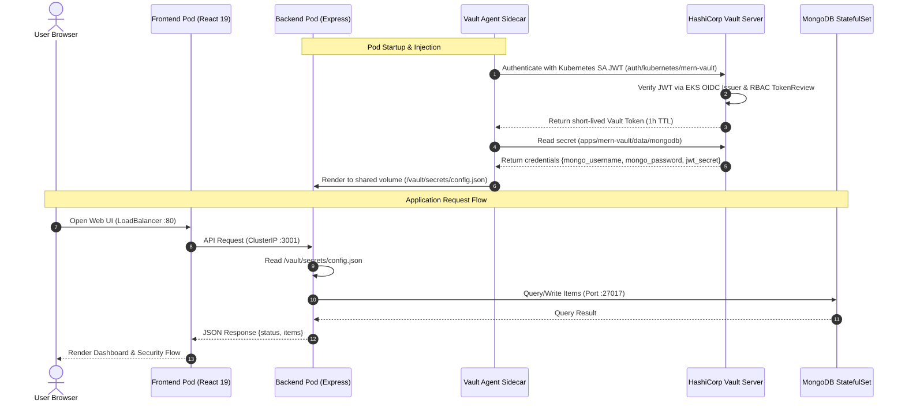

# 07 — MERN + Vault

**Production-grade full MERN stack on Amazon EKS with MongoDB credentials dynamically injected by HashiCorp Vault Agent and EDR monitoring via Uptycs.**


## At a Glance

| | |
|---|---|
| **Stack & Components** | React 19 Frontend + Express Backend + MongoDB 7 StatefulSet |
| **Infrastructure** | Amazon EKS 1.32 (AL2023), VPC, Vault Agent Injector, Uptycs EDR Sensor |
| **Vault Auth Method** | Kubernetes (`auth/kubernetes/mern-vault`) |
| **Vault Secret Engine** | KV v2 (`apps/mern-vault/mongodb`) |
| **HCP Terraform Workspace** | `demo-app-07` |

## Architecture & Secret Injection Flow




### Key Demonstrations & Use Cases in the Live Dashboard

The interactive frontend provides tabbed navigation exploring distinct security concepts and operational value:

1. **Architecture & Live Telemetry**: Live interactive SVG communication diagram showing pod-to-pod networking, Vault Agent mutating webhook injection, and real-time pod metadata from `/api/vault-status`.
2. **Zero-Trust Identity Handshake**: Visual step-by-step breakdown of projected ServiceAccount JWTs, EKS OIDC validation, Vault role policy bindings, and a live simulation trigger (`/api/simulate-auth`).
3. **Sidecar Secret Injection**: Deep dive into Consul Template rendering, pod annotations, and in-memory `emptyDir` file decoupling with zero Vault SDK overhead in application code.
4. **Verified Data Plane**: Interactive transaction engine writing categorized audit records to MongoDB to prove dynamic database credentials work end-to-end.
5. **Threat Model Comparison**: Side-by-side comparison table contrasting traditional Kubernetes secret patterns against HashiCorp Vault zero-trust principles.

## Quick Start

### 1. Configure Workspace Variables in HCP Terraform

Set the required variables in the `demo-app-07` workspace:

```hcl
project_name        = "demo"
vault_address       = "https://vault.christian-renaud.sbx.hashidemos.io"
vault_namespace     = ""
node_instance_type  = "t3.medium"
desired_node_count  = 2
developer_role_arns = ["arn:aws:iam::602343948585:role/aws_christian.renaud_test-developer"]
```

### 2. Trigger a Run

Push to `main` or trigger a plan/apply in HCP Terraform.

### 3. Access and Verify the Cluster

```bash
# 1. Configure local kubectl context
aws eks update-kubeconfig --region us-east-1 --name demo-mern-vault-dev-cluster

# 2. View cluster workloads (verify backend shows 2/2 ready)
kubectl get pods -n mern-vault -o wide

# 3. Verify injected database config inside the pod
kubectl exec -n mern-vault deploy/mern-backend -c mern-backend -- cat /vault/secrets/config.json

# 4. Check Vault authentication logs in the sidecar
kubectl logs -n mern-vault deploy/mern-backend -c vault-agent --tail=20

# 5. Retrieve Kubernetes node UUIDs for IBM CISO Uptycs verification
kubectl get nodes -o=jsonpath='{range .items[*]}{.metadata.name}{"\t"}{.status.nodeInfo.systemUUID}{"\n"}{end}'

# 6. Open the web UI in your browser
kubectl get svc mern-frontend -n mern-vault
# Visit http://<EXTERNAL-IP> in your browser to inspect live Vault injection status & flow
```

## Prerequisites

- Terraform `>= 1.9.0`
- AWS Account with permissions to provision EKS, VPC, subnets, and IAM roles
- Vault server accessible from the EKS VPC
- `demo-apps-vault-config` workspace applied

## Features & Key Capabilities

- **Zero Hardcoded Secrets**: MongoDB credentials and application JWT secrets are managed entirely inside Vault.
- **Microservices Pod Injection**: Multiple services (Express backend & MongoDB init) consume secrets via Vault Agent templates.
- **Enterprise Security Compliance**: Uptycs EDR sensor deployed on all worker nodes.
- **Red Hat UBI Minimal Images**: All custom application images are based on `registry.redhat.io/ubi9/nodejs-20-minimal` and `registry.redhat.io/rhel9/mongodb-70`.
- **EKS Access Entries**: Developer IAM roles mapped directly with `AmazonEKSClusterAdminPolicy`.

## Inputs

| Name | Description | Type | Default | Required |
|---|---|---|---|---|
| `project_name` | Naming prefix for cluster and resources | `string` | — | yes |
| `vault_address` | Vault cluster URL | `string` | — | yes |
| `uptycs_helm_repo_url` | Helm repository URL for IBM CISO Uptycs chart | `string` | — | yes |
| `uptycs_chart_version` | Uptycs Helm chart version | `string` | — | yes |
| `uptycs_owner_email` | OWNER tag email for Uptycs compliance | `string` | — | yes |
| `vault_namespace` | Vault namespace (`""` for root / self-managed, `"admin"` for HCP) | `string` | `""` | no |
| `aws_region` | AWS region | `string` | `"us-east-1"` | no |
| `environment` | Deployment environment (`dev`, `staging`, `prod`, `sandbox`) | `string` | `"dev"` | no |
| `vpc_cidr` | VPC CIDR block | `string` | `"10.30.0.0/16"` | no |
| `node_instance_type` | EKS node instance type | `string` | `"t3.medium"` | no |
| `desired_node_count` | Desired EKS node count | `number` | `2` | no |
| `developer_role_arns` | IAM role ARNs granted EKS admin access | `list(string)` | `[]` | no |
| `uptycs_update_tag` | Uptycs UPDATE tag per IBM Tag Guide | `string` | `"NONE"` | no |
| `mongodb_atlas_public_key` | MongoDB Atlas API key (for optional Atlas integration) | `string` | `""` | no (sensitive) |

## Outputs

| Name | Description |
|---|---|
| `app_url` | Public URL of the frontend application (LoadBalancer hostname) |
| `cluster_name` | EKS cluster name |
| `cluster_endpoint` | EKS cluster API server endpoint |
| `cluster_certificate_authority_data` | Base64-encoded CA data for the EKS cluster |
| `vault_secret_path` | Vault KV path for MongoDB credentials |
| `vault_k8s_auth_path` | Vault Kubernetes auth backend mount path |
| `vault_role` | Vault Kubernetes auth role name |
| `kubeconfig_command` | Command to configure kubectl for the cluster |
| `kubectl_context` | Full kubectl context name |
| `frontend_service` | Command to inspect the React frontend service |
| `uptycs_tag_string` | IBM tag string applied to the Uptycs sensor |
| `uptycs_node_uuid_command` | Command to retrieve node UUIDs for Uptycs verification |

## Local Development

```bash
# Backend
cd app/backend
cp .env.example .env
echo '{"mongo_username":"root","mongo_password":"test","mongo_host":"localhost","mongo_port":"27017","mongo_database":"merndb","jwt_secret":"test"}' > secrets.json
npm install && npm start

# Frontend (in a separate terminal)
cd app/frontend
cp .env.example .env
npm install && npm run dev
```

> [!IMPORTANT]
> For local development without Kubernetes, run MongoDB locally: `docker run -d -p 27017:27017 -e MONGO_INITDB_ROOT_USERNAME=root -e MONGO_INITDB_ROOT_PASSWORD=test mongo:7`

## License

Business Source License 1.1
