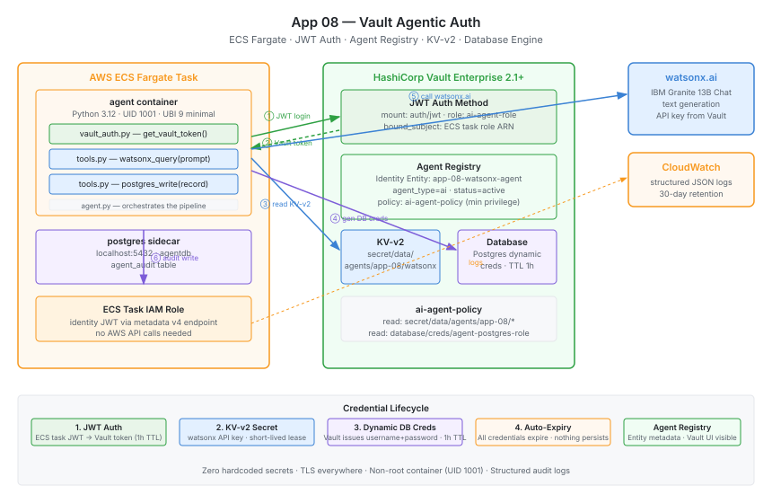

# 08 — Vault Agentic Auth (Python + ECS Fargate)

**An AI agent on ECS Fargate that authenticates to HashiCorp Vault Enterprise using a short-lived JWT — no static secrets, no API keys in code — and uses ephemeral credentials to call watsonx.ai and write an audit record to Postgres.**


## What This Demo Proves

This app demonstrates Vault Enterprise's **Agentic IAM / Agent Registry** capability, introduced in Vault 2.1.0. An AI agent running on ECS Fargate presents its ECS task identity JWT to Vault's JWT auth method. Vault validates the token, resolves the caller to a registered Agent Registry entry (a Vault Identity entity with `agent_type = "ai"` metadata), and issues a short-lived Vault token scoped to the minimum required policy. The agent then fetches a watsonx.ai API key from KV-v2 and generates dynamic Postgres credentials from the Database secrets engine — both are ephemeral and expire automatically. No credentials are hardcoded, stored in environment variables at deployment time, or persisted after the run.

## At a Glance

| | |
|---|---|
| **Language & Runtime** | Python 3.12 · UBI 9 minimal (non-root) |
| **Infrastructure** | AWS ECS Fargate, ECR, VPC, IAM, CloudWatch |
| **Vault Auth Method** | JWT (`auth/jwt`) — ECS task identity token |
| **Vault Secret Engines** | KV-v2 (`secret/`) · Database (`database/`) |
| **Agent Registry** | `vault_identity_entity` with `agent_type = "ai"` metadata |
| **AI Backend** | watsonx.ai (IBM Granite 13B Chat) |
| **Audit Sink** | Postgres sidecar container on ECS |
| **HCP Terraform Workspace** | `demo-app-08` |

## Architecture



```
┌──────────────────────────────────────────────────────────────────────────────┐
│ AWS ECS Fargate Task                                                          │
│                                                                               │
│  agent container (Python 3.12, UID 1001)                                     │
│    │                                                                          │
│    │ 1. GET /task/identity-token (ECS metadata v4 endpoint)                  │
│    │    → short-lived ECS task JWT                                            │
│    │                                                                          │
│    │ 2. POST /v1/auth/jwt/login  role=ai-agent-role  jwt=<task-jwt>          │
│    ▼                                                                          │
│  HashiCorp Vault Enterprise 2.1+                                             │
│    │ 3. Validates JWT against AWS OIDC issuer                                │
│    │ 4. Resolves to Agent Registry entity (agent_type=ai)                    │
│    │ 5. Issues short-lived Vault token (TTL=1h)                              │
│    │                                                                          │
│    │ 6. GET /v1/secret/data/agents/app-08/watsonx → {api_key}                │
│    │ 7. GET /v1/database/creds/agent-postgres-role → {username, password}    │
│    ▼                                                                          │
│  agent uses credentials:                                                     │
│    │ 8. POST watsonx.ai → inference response                                 │
│    │ 9. INSERT INTO agent_audit (Postgres sidecar)                           │
│    │                                                                          │
│    └─ Credentials expire automatically (KV lease + DB TTL)                  │
└──────────────────────────────────────────────────────────────────────────────┘
```

## Prerequisites

- Terraform `>= 1.9.0`
- AWS account with permissions to provision ECS, ECR, VPC, IAM, and CloudWatch
- **Vault Enterprise 2.1+** with the `Agent Registry` feature enabled
- An HCP Terraform organization (workspace `demo-app-08`)
- A watsonx.ai API key and project ID
- Docker (to build and push the agent image)

## Quick Start

### 1. Configure Workspace Variables in HCP Terraform

Set the following in the `demo-app-08` workspace. Mark `watsonx_api_key` and `postgres_admin_password` as **sensitive**:

```hcl
project_name            = "demo"
environment             = "dev"
aws_region              = "us-east-1"
vault_address           = "https://vault.example.com"
vault_namespace         = "admin"
watsonx_project_id      = "your-project-id"
watsonx_api_key         = "..."   # sensitive
postgres_admin_password = "..."   # sensitive
```

### 2. Apply the Terraform Configuration

```bash
cd apps/08-vault-agentic-auth/terraform
terraform init
terraform apply
```

### 3. Build and Push the Agent Image

After `terraform apply`, use the `docker_push_commands` output:

```bash
# Output from terraform apply:
terraform output -raw docker_push_commands | bash
```

Or manually:

```bash
ECR_URL=$(terraform output -raw ecr_repository_url)
aws ecr get-login-password --region us-east-1 | \
  docker login --username AWS --password-stdin $ECR_URL

docker build -t $ECR_URL:latest ../app/agent/
docker push $ECR_URL:latest
```

### 4. Run the Agent

Trigger the ECS service to run a task (it starts automatically with `desired_count = 1`):

```bash
# Force a new deployment to pick up a freshly pushed image
aws ecs update-service \
  --cluster $(terraform output -raw ecs_cluster_name) \
  --service $(terraform output -raw ecs_service_name) \
  --force-new-deployment
```

## How the Agent Registry Entry Appears in Vault UI

1. Open the Vault UI and navigate to **Access → Entities**.
2. Search for entity name `app-08-watsonx-agent`.
3. Under **Metadata**, you will see:
   - `agent_type = ai`
   - `agent_name = app-08-watsonx-agent`
   - `operational_status = active`
   - `auth_method = jwt`
4. The **Policies** tab shows the `ai-agent-policy` granting minimum read access.
5. The **Aliases** tab shows the JWT alias bound to the ECS task role ARN.

> **Note:** In Vault Enterprise with the Agent Registry licence feature, the Vault UI also renders a dedicated **Agents** page under **Access**, which reads the `agent_type = "ai"` metadata to list all registered AI agents.

## Verifying the Agent Ran

### CloudWatch Logs

```bash
LOG_GROUP=$(terraform output -raw cloudwatch_log_group)

# Agent structured logs
aws logs tail $LOG_GROUP --log-stream-name-prefix agent --follow

# Expected output (structured JSON):
# {"level": "INFO", "msg": "Vault JWT auth successful — token TTL=3600, policies=[\"ai-agent-policy\"]"}
# {"level": "INFO", "msg": "Read KV-v2 secret at path=secret/data/agents/app-08/watsonx"}
# {"level": "INFO", "msg": "Generated dynamic DB creds — username=v-agent-xxxxxxxx"}
# {"level": "INFO", "msg": "watsonx.ai response received — tokens_generated=..."}
# {"level": "INFO", "msg": "Audit record written — pipeline complete"}
```

### Postgres Audit Table

Dynamic Postgres credentials expire after their TTL. To inspect the audit table while the task is running, exec into the ECS task:

```bash
TASK_ARN=$(aws ecs list-tasks \
  --cluster $(terraform output -raw ecs_cluster_name) \
  --service-name $(terraform output -raw ecs_service_name) \
  --query 'taskArns[0]' --output text)

aws ecs execute-command \
  --cluster $(terraform output -raw ecs_cluster_name) \
  --task $TASK_ARN \
  --container postgres \
  --command "psql -U vaultadmin -d agentdb -c 'SELECT ts, agent_name, event_type, payload FROM agent_audit ORDER BY ts DESC LIMIT 5;'" \
  --interactive
```

## Inputs

| Name | Description | Type | Default | Required |
|---|---|---|---|---|
| `project_name` | Naming prefix for all resources | `string` | — | yes |
| `vault_address` | Vault cluster URL | `string` | — | yes |
| `watsonx_api_key` | watsonx.ai API key (sensitive) | `string` | — | yes |
| `watsonx_project_id` | watsonx.ai project ID | `string` | — | yes |
| `postgres_admin_password` | Postgres admin password for Vault DB engine (sensitive) | `string` | — | yes |
| `vault_namespace` | Vault namespace (`""` for root, `"admin"` for HCP) | `string` | `""` | no |
| `aws_region` | AWS region | `string` | `"us-east-1"` | no |
| `environment` | Deployment environment | `string` | `"dev"` | no |
| `vpc_cidr` | VPC CIDR block | `string` | `"10.80.0.0/16"` | no |
| `public_subnet_cidrs` | Public subnet CIDRs | `list(string)` | `["10.80.1.0/24", "10.80.2.0/24"]` | no |
| `private_subnet_cidrs` | Private subnet CIDRs | `list(string)` | `["10.80.10.0/24", "10.80.11.0/24"]` | no |
| `agent_prompt` | Prompt sent to watsonx.ai | `string` | *(zero-trust summary)* | no |
| `db_creds_ttl` | Dynamic DB credential TTL | `string` | `"1h"` | no |
| `vault_token_ttl` | Vault token TTL for the agent | `string` | `"1h"` | no |

## Outputs

| Name | Description |
|---|---|
| `ecs_cluster_name` | ECS cluster name |
| `ecs_service_name` | ECS agent service name |
| `ecr_repository_url` | ECR URL — push the agent image here |
| `cloudwatch_log_group` | CloudWatch log group for all containers |
| `vault_jwt_auth_path` | Vault JWT auth mount path |
| `vault_jwt_role` | Vault JWT auth role name |
| `vault_policy_name` | Vault policy name |
| `vault_kv_secret_path` | Vault KV-v2 path for the watsonx API key |
| `vault_db_role` | Vault Database secrets engine role |
| `vault_agent_entity_id` | Vault Identity entity ID (Agent Registry) |
| `vault_agent_entity_name` | Vault Identity entity name (Agent Registry) |
| `ecs_task_role_arn` | IAM role ARN bound to the JWT sub claim |
| `docker_push_commands` | Ready-to-run ECR push commands |

## Local Development

Local development requires a running Vault instance with the JWT auth method pre-configured and a `VAULT_TOKEN` with the `ai-agent-policy` already attached (bypassing the ECS JWT flow):

```bash
cd app/agent
python3.12 -m venv .venv && source .venv/bin/activate
pip install -r requirements.txt

export VAULT_ADDR="https://vault.example.com"
export VAULT_NAMESPACE="admin"
export VAULT_TOKEN="hvs.your-dev-token"   # must have ai-agent-policy
export WATSONX_PROJECT_ID="your-project-id"
export POSTGRES_HOST="localhost"
export POSTGRES_DB="agentdb"

# Override ECS JWT auth — supply a pre-issued Vault token directly
# by patching vault_auth.get_vault_token() to return os.environ["VAULT_TOKEN"]
python src/agent.py
```

> [!IMPORTANT]
> `vault_auth.get_vault_token()` requires `ECS_CONTAINER_METADATA_URI_V4` to be set (only present inside ECS tasks). For local testing, export a pre-issued `VAULT_TOKEN` and call `get_kv_secret` and `get_dynamic_db_creds` directly.

## License

Business Source License 1.1
